# Mirzapur
CTF Writeup

1.  CTF url is given, Let's see what is there\...
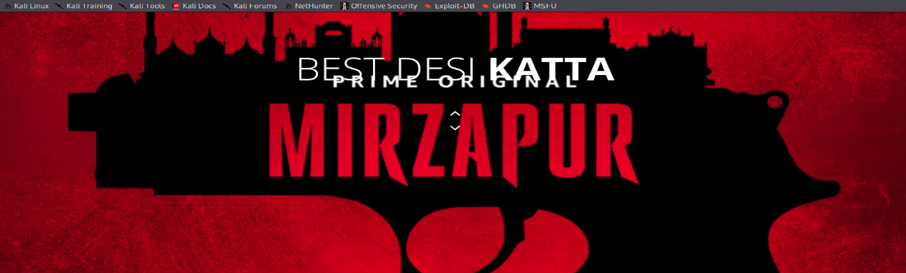

2.  I checked the source of the page and there I found
> Mirzapur\_ka\_Rasta.js
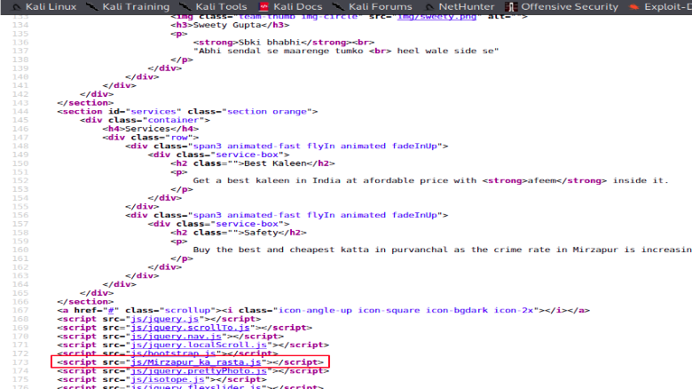

3.  The JS code written inside was\...
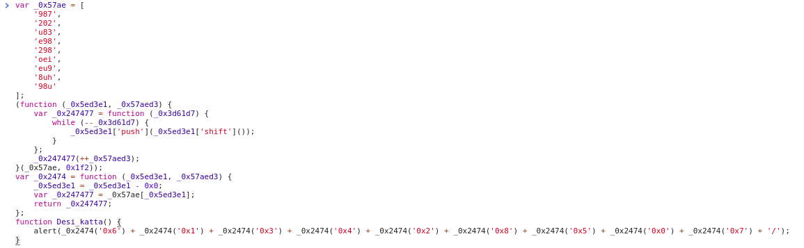

4.  Let's call the Desi\_Katta() function\...
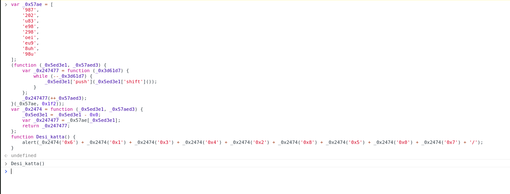

5.  Check the alertBox it looks like a directory\...
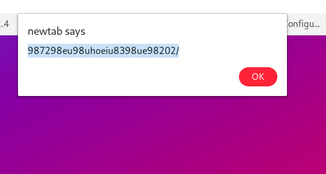

6.  Going there only gave me more and more web pages\...
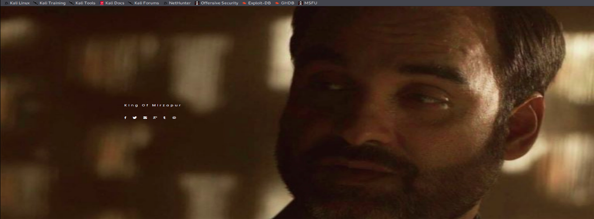

7.  One of the URL linked there has parameter "id" and the value was 1. I tried SQL injection with many tempore scripts but no luck. After a few times I got the hint that not every parameter is vulnerable to SQL injection. Hence I tried file retrieval and it was a success.

> ?id=/etc/passwd
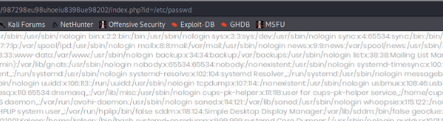

8.  From /etc/passwd we have the user "munna". But what is the password??? Let's check Bash History for clues\...
> id=/home/munna/.bash\_history
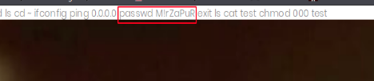

9.  Looks like the user have typed password along with passwd command without giving enter.(or at least the CTF builder wants to tell us that). SSH Done. It was RBash. The PATH variable lead me to this directory and the available commands were very few. Also, we have an interesting language that we can use "LUA".
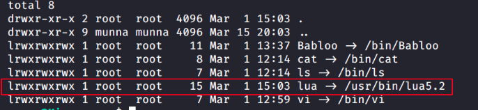

10. A quick search on google gave me lua to shell\...
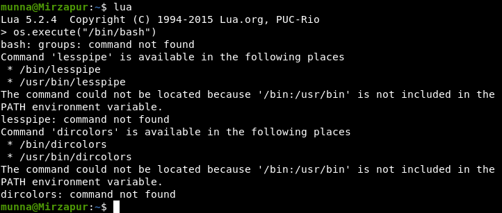

11. Once I am out of RBash I tried grep command and two flags at once...
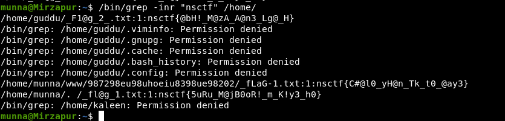
